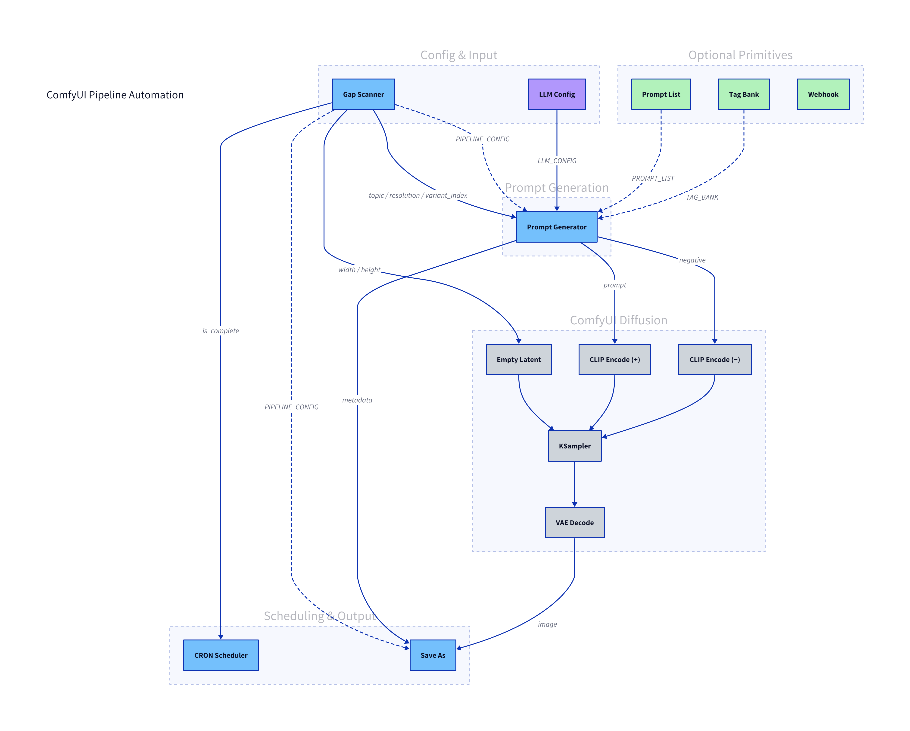

# ComfyUI Pipeline Automation

Automated batch image generation for ComfyUI. Turns manual one-at-a-time workflows into unattended, crash-proof production pipelines that can generate thousands of organized, metadata-rich outputs overnight.

## Installation

Clone into your ComfyUI `custom_nodes` directory and run the setup script:

```bash
cd ComfyUI/custom_nodes
git clone https://github.com/KailasMahavarkar/comfyui-pipeline-automation.git
cd comfyui-pipeline-automation
python setup.py
```

Restart ComfyUI. All nodes appear under **Pipeline Automation** in the node menu.

### Requirements

- Pillow >= 9.0.0
- numpy >= 1.20.0
- piexif >= 1.1.3
- croniter >= 1.0.0

## Pipeline Flow



| Color | Meaning |
|-------|---------|
| **Blue** | Custom pipeline nodes (Gap Scanner, Prompt Generator, CRON Scheduler, Save As) |
| **Purple** | LLM/API nodes (LLM Config, API Call) |
| **Pink** | Standalone utility (Bulk Prompter) |
| **Gray** | Standard ComfyUI nodes (CLIP Encode, KSampler, VAE Decode, Empty Latent) |

### How It Works

1. **Gap Scanner** scans the output folder and finds the next missing topic/resolution/variant combo
2. **Prompt Generator** generates (or loads cached) prompt variants for that topic, picks the one at `variant_index`
3. **LLM Config** (optional) provides connection settings for LLM-based tag generation
4. Standard ComfyUI nodes (CLIP Encode, KSampler, VAE Decode) generate the image
5. **CRON Scheduler** sits in the execution chain and re-queues the workflow on schedule
6. **Save As** saves with organized naming, embedded metadata, and optional sidecar/manifest
7. On next run, Gap Scanner advances to the next missing entry
8. When all gaps are filled, `is_complete` goes true and CRON Scheduler stops

The filesystem is the source of truth — if ComfyUI crashes, restart and the pipeline resumes exactly where it left off.

## Nodes

### Gap Scanner

Scans the output directory against a planned generation matrix (topics × resolutions × prompts per topic) and emits the next missing entry. Acts as the single source of truth for shared pipeline settings via `PIPELINE_CONFIG`.

**Inputs:**

| Input | Type | Default | Description |
|-------|------|---------|-------------|
| `workflow_name` | STRING | — | Name for this workflow run |
| `topic_list` | STRING | — | Topics to generate (one per line) |
| `resolution_list` | STRING | `512x512` | Resolutions to cover (one per line) |
| `prompts_per_topic` | INT | `50` | Number of prompt variants per topic |
| `output_dir` | STRING | `output` | Base output directory |
| `format` | ENUM | `png` | Image format: png, jpeg, webp |
| `reset_workflow` | BOOLEAN | `false` | Clear cached state and restart |

**Outputs:**

| Output | Type | Description |
|--------|------|-------------|
| `topic` | STRING | Next topic to generate |
| `resolution` | STRING | Resolution string (e.g. `512x512`) |
| `width` | INT | Parsed width |
| `height` | INT | Parsed height |
| `variant_index` | INT | Which prompt variant to use (0-indexed) |
| `is_complete` | BOOLEAN | True when all gaps are filled |
| `status` | STRING | Progress info with percentage |
| `pipeline_config` | PIPELINE_CONFIG | Shared settings dict |

---

### Prompt Generator

Takes a topic and variant index, generates prompt variants using 6 local mutation strategies (synonym swap, detail injection, style shuffle, weight jitter, clause reorder, template fill), and optionally generates tags via LLM. Caches results to disk per topic.

**Inputs:**

| Input | Type | Default | Description |
|-------|------|---------|-------------|
| `topic` | STRING | — | Topic from Gap Scanner |
| `variant_index` | INT | `0` | Which variant to select |
| `base_prompt_template` | STRING | `a beautiful {topic}, highly detailed` | Template with `{topic}` placeholder |
| `base_negative_prompt` | STRING | `blurry, watermark, text, low quality` | Negative prompt |
| `prompts_per_topic` | INT | `50` | How many variants to generate |
| `pipeline_config` | PIPELINE_CONFIG | — | Optional shared settings |
| `resolution` | STRING | `512x512` | For resolution-aware tags |
| `llm_config` | LLM_CONFIG | — | Optional LLM for tag generation |
| `custom_word_bank_path` | STRING | — | Path to custom word bank JSON |
| `topic_tag_bank` | STRING | — | Extra tags per topic (multiline) |

**Outputs:**

| Output | Type | Description |
|--------|------|-------------|
| `prompt` | STRING | The selected prompt variant |
| `negative_prompt` | STRING | Negative prompt |
| `metadata` | STRING | JSON with tags, pipeline state, provenance |

---

### LLM Config

Structured LLM connection settings with provider presets. Outputs a typed `LLM_CONFIG` object — no manual JSON required. Can be shared between Prompt Generator (for tag generation) and API Call (for custom LLM calls).

**Inputs:**

| Input | Type | Default | Description |
|-------|------|---------|-------------|
| `provider` | ENUM | — | OpenRouter, OpenAI, Ollama, LM Studio, Custom |
| `model` | STRING | `anthropic/claude-3-haiku` | Model identifier |
| `api_key` | STRING | — | API key (not needed for Ollama/LM Studio) |
| `api_url_override` | STRING | — | Override auto-detected URL |
| `temperature` | FLOAT | `0.7` | Sampling temperature (0.0–2.0) |
| `max_tokens` | INT | `200` | Max response tokens |

**Provider URL mapping:**

| Provider | Auto-fills URL |
|----------|---------------|
| OpenRouter | `https://openrouter.ai/api/v1/chat/completions` |
| OpenAI | `https://api.openai.com/v1/chat/completions` |
| Ollama | `http://localhost:11434/v1/chat/completions` |
| LM Studio | `http://localhost:1234/v1/chat/completions` |
| Custom | User-provided |

---

### CRON Scheduler

Re-queues the current workflow on a schedule via a background thread. Skips ticks when ComfyUI's queue is busy. Stops automatically when `is_complete` is true. Passthrough accepts any type (IMAGE, LATENT, STRING, etc.) so it can sit anywhere in the graph.

**Inputs:**

| Input | Type | Default | Description |
|-------|------|---------|-------------|
| `schedule_preset` | ENUM | — | Every 1 min, Every 5 min, Every 15 min, Every 30 min, Hourly, Every 6 hours, Daily at midnight, Daily at 9 AM, Custom |
| `cron_expression` | STRING | `*/5 * * * *` | Cron expression (used when preset is Custom) |
| `enabled` | BOOLEAN | `false` | Enable/disable scheduling |
| `mode` | ENUM | `requeue_workflow` | requeue_workflow, run_command, both |
| `comfyui_api_url` | STRING | `http://127.0.0.1:8188` | ComfyUI API endpoint |
| `max_iterations` | INT | `0` | Max iterations (0 = unlimited) |
| `external_command` | STRING | — | Shell command for run_command mode |
| `passthrough` | * | — | Any-type passthrough |
| `is_complete` | BOOLEAN | `false` | Stops scheduler when true |

**Outputs:**

| Output | Type | Description |
|--------|------|-------------|
| `status` | STRING | Scheduler state |
| `passthrough` | * | Any-type passthrough |

---

### Save As

Saves images with template-based filenames, organized subfolders, and rich metadata.

**Inputs:**

| Input | Type | Default | Description |
|-------|------|---------|-------------|
| `image` | IMAGE | — | Image to save |
| `format` | ENUM | `png` | png, jpeg, webp |
| `quality` | INT | `95` | Compression quality (1–100) |
| `naming_preset` | ENUM | `Simple` | Simple, Detailed, Minimal, Custom |
| `filename_prefix` | STRING | `comfyui` | Filename prefix |
| `subfolder_template` | STRING | `{topic}/{resolution}` | Subfolder path template |
| `embed_metadata` | BOOLEAN | `true` | Embed metadata into image |
| `write_sidecar` | BOOLEAN | `false` | Write .json sidecar file |
| `write_manifest` | BOOLEAN | `false` | Append to manifest.csv |
| `pipeline_config` | PIPELINE_CONFIG | — | Overrides format and output_dir |
| `naming_template` | STRING | — | Custom naming template |
| `metadata` | STRING | — | JSON metadata from Prompt Generator |
| `output_dir` | STRING | `output` | Base output directory |

**Features:**
- **Naming tokens**: `{topic}`, `{resolution}`, `{date}`, `{time}`, `{counter}`, `{seed}`
- **Metadata embedding**: PNG tEXt, JPEG EXIF, WebP XMP
- **Sidecar JSON**: Full metadata including tags, provenance, and pipeline state
- **Manifest CSV**: Append-only global index of all outputs

**Outputs:**

| Output | Type | Description |
|--------|------|-------------|
| `saved_paths` | STRING | Comma-separated saved file paths |

---

### API Call

Calls any REST API (OpenAI-compatible preset or generic). Supports configurable retry with exponential backoff, dot-path response mapping, and auto-parsing of stringified JSON. Standalone utility node.

**Inputs:**

| Input | Type | Default | Description |
|-------|------|---------|-------------|
| `api_preset` | ENUM | — | openai_compatible, generic |
| `api_url` | STRING | — | API endpoint |
| `method` | ENUM | `POST` | POST, GET |
| `request_template` | STRING | — | JSON request body template |
| `response_mapping` | STRING | `prompt=choices.0.message.content` | Dot-path response extraction |
| `timeout` | INT | `30` | Request timeout (seconds) |
| `max_retries` | INT | `3` | Max retry attempts |
| `retry_delay` | INT | `2` | Base delay between retries (seconds) |
| `llm_config` | LLM_CONFIG | — | Overrides api_url, api_key, model |
| `api_key` | STRING | — | API key (manual) |
| `headers` | STRING | — | Custom headers (JSON) |
| `topic` | STRING | — | Available in request template as `{topic}` |

**Outputs:**

| Output | Type | Description |
|--------|------|-------------|
| `prompt` | STRING | Extracted prompt from response |
| `negative_prompt` | STRING | Extracted negative prompt |
| `metadata` | STRING | JSON of all extracted fields |
| `raw_response` | STRING | Raw API response string |

---

### Bulk Prompter

Generates N prompt variants from a base prompt using local mutation strategies. Zero API calls — uses bundled word banks. Standalone utility node.

**Inputs:**

| Input | Type | Default | Description |
|-------|------|---------|-------------|
| `base_prompt` | STRING | — | Base prompt to mutate |
| `num_variants` | INT | `10` | Number of variants to generate |
| `strategies` | STRING | all | Comma-separated strategy names |
| `custom_word_bank_path` | STRING | — | Path to custom word bank JSON |
| `seed` | INT | `-1` | Random seed (-1 = random) |

**Outputs:**

| Output | Type | Description |
|--------|------|-------------|
| `variants` | STRING | JSON array of prompt strings |
| `count` | INT | Number of variants generated |

## Wiring Map

| Source | Output | Type | Target | Input |
|--------|--------|------|--------|-------|
| Gap Scanner | `topic` | STRING | Prompt Generator | `topic` |
| Gap Scanner | `resolution` | STRING | Prompt Generator | `resolution` |
| Gap Scanner | `variant_index` | INT | Prompt Generator | `variant_index` |
| Gap Scanner | `width` | INT | Empty Latent Image | `width` |
| Gap Scanner | `height` | INT | Empty Latent Image | `height` |
| Gap Scanner | `is_complete` | BOOLEAN | CRON Scheduler | `is_complete` |
| Gap Scanner | `pipeline_config` | PIPELINE_CONFIG | Prompt Generator | `pipeline_config` |
| Gap Scanner | `pipeline_config` | PIPELINE_CONFIG | Save As | `pipeline_config` |
| LLM Config | `llm_config` | LLM_CONFIG | Prompt Generator | `llm_config` |
| LLM Config | `llm_config` | LLM_CONFIG | API Call | `llm_config` |
| Prompt Generator | `prompt` | STRING | CLIP Text Encode | `text` |
| Prompt Generator | `negative_prompt` | STRING | CLIP Text Encode (neg) | `text` |
| Prompt Generator | `metadata` | STRING | Save As | `metadata` |
| CRON Scheduler | `passthrough` | * | Save As | `image` |

## Custom Types

Two dict-based types are passed between nodes:

**PIPELINE_CONFIG:**
```python
{
    "workflow_name": "my_workflow",
    "output_dir": "output",
    "format": "png",
    "prompts_per_topic": 50
}
```

**LLM_CONFIG:**
```python
{
    "provider": "OpenRouter",
    "api_url": "https://openrouter.ai/api/v1/chat/completions",
    "api_key": "sk-...",
    "model": "anthropic/claude-3-haiku",
    "temperature": 0.7,
    "max_tokens": 200
}
```

## Output Structure

```
output/
└── my_workflow/
    ├── .prompt_cache/
    │   └── sunset_beach.json
    ├── sunset_beach/
    │   └── 512x512/
    │       ├── sunset_beach_512x512_001.png
    │       └── sunset_beach_512x512_001.json   (sidecar, optional)
    └── manifest.csv                            (optional)
```

## Standalone Use

Save As, API Call, Bulk Prompter, and LLM Config work independently in any workflow — no pipeline required. Drop them into any ComfyUI graph and they function as standalone utility nodes.

## License

MIT
