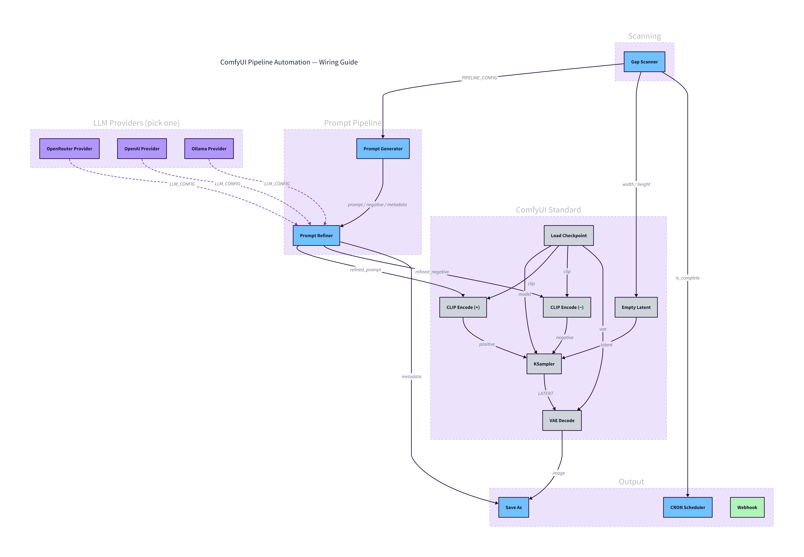

# Node Reference

Complete input/output reference for all Pipeline Automation nodes.

## Gap Scanner

Scans the output directory against a planned generation matrix (topics x resolutions x prompts per topic) and emits the next missing entry. Packs all per-execution state into `PIPELINE_CONFIG`.

**Inputs:**

| Input | Type | Required | Default | Description |
|-------|------|----------|---------|-------------|
| `workflow_name` | STRING | yes | — | Name for this workflow run |
| `topic_list` | STRING | yes | — | Topics to generate (one per line) |
| `resolution_list` | STRING | yes | `512x512` | Resolutions to cover (one per line) |
| `prompts_per_topic` | INT | yes | `50` | Number of prompt variants per topic |
| `output_dir` | STRING | no | `output` | Base output directory |
| `format` | ENUM | no | `png` | Image format: png, jpeg, webp |
| `reset_workflow` | BOOLEAN | no | `false` | Delete workflow output and restart |

**Outputs:**

| Output | Type | Description |
|--------|------|-------------|
| `width` | INT | Parsed width from resolution |
| `height` | INT | Parsed height from resolution |
| `is_complete` | BOOLEAN | True when all gaps are filled |
| `status` | STRING | Progress info with topic, variant, and percentage |
| `pipeline_config` | PIPELINE_CONFIG | Shared settings for downstream nodes |

---

## Prompt Generator

Generates prompt variants from a base template using local mutation strategies. Reads topic, resolution, and variant index from `PIPELINE_CONFIG`. Caches generated variants to disk per workflow/topic.

**Mutation strategies:** synonym swap, detail injection, style shuffle, weight jitter, reorder, template fill.

**Inputs:**

| Input | Type | Required | Default | Description |
|-------|------|----------|---------|-------------|
| `pipeline_config` | PIPELINE_CONFIG | yes | — | Config from Gap Scanner |
| `base_prompt_template` | STRING | yes | `{topic}, highly detailed, sharp focus, professional quality` | Template with `{topic}` placeholder |
| `base_negative_prompt` | STRING | yes | `blurry, low quality, watermark, text, deformed, ugly, distorted` | Negative prompt |

**Outputs:**

| Output | Type | Description |
|--------|------|-------------|
| `prompt` | STRING | The selected prompt variant |
| `negative_prompt` | STRING | Negative prompt (passed through) |
| `metadata` | STRING | JSON with tags, pipeline state, and variant info |

---

## Prompt Refiner

Enhances a prompt and generates a matching negative prompt via LLM. Drop between Prompt Generator and CLIP Encode. Caches results per input prompt. Falls back to original prompt silently on failure.

**Inputs:**

| Input | Type | Required | Default | Description |
|-------|------|----------|---------|-------------|
| `prompt` | STRING | yes | — | Prompt from Prompt Generator (forceInput) |
| `negative_prompt` | STRING | yes | — | Negative prompt (forceInput) |
| `metadata` | STRING | yes | — | Metadata JSON (forceInput) |
| `llm_config` | LLM_CONFIG | yes | — | Config from a Provider node |
| `api_url_override` | STRING | no | — | Override the provider's URL |
| `positive_guidance` | STRING | no | — | Always include these elements |
| `negative_guidance` | STRING | no | — | Always avoid these elements |

**Outputs:**

| Output | Type | Description |
|--------|------|-------------|
| `refined_prompt` | STRING | LLM-enhanced prompt |
| `refined_negative` | STRING | LLM-generated negative prompt |
| `metadata` | STRING | Metadata (passed through) |

---

## OpenRouter Provider

Builds an `LLM_CONFIG` for the OpenRouter API.

**Inputs:**

| Input | Type | Required | Default | Description |
|-------|------|----------|---------|-------------|
| `model` | STRING | yes | `google/gemini-3.1-flash-lite-preview` | Model identifier |
| `api_key_name` | STRING | no | `openrouter` | Key name in `automation_api_keys.json` |
| `temperature` | FLOAT | no | `0.7` | Sampling temperature (0.0-2.0) |
| `max_tokens` | INT | no | `1024` | Max response tokens (100-4096) |

**Outputs:**

| Output | Type | Description |
|--------|------|-------------|
| `llm_config` | LLM_CONFIG | Provider config for Prompt Refiner |

---

## OpenAI Provider

Builds an `LLM_CONFIG` for the OpenAI API.

**Inputs:**

| Input | Type | Required | Default | Description |
|-------|------|----------|---------|-------------|
| `model` | STRING | yes | `gpt-4o-mini` | Model identifier |
| `api_key_name` | STRING | no | `openai` | Key name in `automation_api_keys.json` |
| `temperature` | FLOAT | no | `0.7` | Sampling temperature (0.0-2.0) |
| `max_tokens` | INT | no | `1024` | Max response tokens (100-4096) |

**Outputs:**

| Output | Type | Description |
|--------|------|-------------|
| `llm_config` | LLM_CONFIG | Provider config for Prompt Refiner |

---

## Ollama Provider

Builds an `LLM_CONFIG` for Ollama (local or cloud).

**Inputs:**

| Input | Type | Required | Default | Description |
|-------|------|----------|---------|-------------|
| `mode` | ENUM | yes | — | `local` (localhost:11434) or `cloud` (ollama.com) |
| `model` | STRING | yes | `llama3` | Model identifier |
| `api_key_name` | STRING | no | auto | Auto-resolves to `ollama_local` or `ollama_cloud` based on mode |
| `temperature` | FLOAT | no | `0.7` | Sampling temperature (0.0-2.0) |
| `max_tokens` | INT | no | `1024` | Max response tokens (100-4096) |

**Outputs:**

| Output | Type | Description |
|--------|------|-------------|
| `llm_config` | LLM_CONFIG | Provider config for Prompt Refiner |

---

## CRON Scheduler

Re-queues the current workflow on a schedule via a background thread. Skips ticks when ComfyUI's queue is busy. Stops automatically when `is_complete` is true or when the user cancels an execution. Marked as `OUTPUT_NODE` so it always executes.

**Inputs:**

| Input | Type | Required | Default | Description |
|-------|------|----------|---------|-------------|
| `is_complete` | BOOLEAN | yes | — | From Gap Scanner (forceInput) |
| `schedule_preset` | ENUM | yes | — | Continuous (5s), Every 1/5/15/30 min, Hourly, Every 6/12 hours, Daily |
| `comfyui_api_url` | STRING | yes | `http://127.0.0.1:8188` | ComfyUI API endpoint |
| `interval_seconds` | INT | no | `60` | Custom interval in seconds (10-86400) |

**Outputs:**

| Output | Type | Description |
|--------|------|-------------|
| `status` | STRING | Scheduler state with run count and next run time |

---

## Save As

Saves images with template-based filenames, organized subfolders, and rich metadata.

**Inputs:**

| Input | Type | Required | Default | Description |
|-------|------|----------|---------|-------------|
| `image` | IMAGE | yes | — | Image to save |
| `format` | ENUM | yes | `png` | png, jpeg, webp |
| `quality` | INT | yes | `95` | Compression quality (1-100) |
| `naming_preset` | ENUM | yes | `Simple` | Simple, Detailed, Minimal, Custom |
| `filename_prefix` | STRING | yes | `comfyui` | Filename prefix |
| `subfolder_template` | STRING | yes | `{topic}/{resolution}` | Subfolder path template |
| `embed_metadata` | BOOLEAN | yes | `true` | Embed metadata into image |
| `write_sidecar` | BOOLEAN | yes | `false` | Write .json sidecar file |
| `write_manifest` | BOOLEAN | yes | `false` | Append to manifest.csv |
| `naming_template` | STRING | no | — | Custom naming template (for Custom preset) |
| `metadata` | STRING | no | — | JSON metadata from Prompt Generator/Refiner |
| `output_dir` | STRING | no | `output` | Base output directory |

**Naming presets:**

| Preset | Template |
|--------|----------|
| Simple | `{prefix}_{date}_{time}` |
| Detailed | `{prefix}_{topic}_{resolution}_{counter}` |
| Minimal | `{prefix}_{counter}` |
| Custom | User-provided via `naming_template` |

**Naming tokens:** `{prefix}`, `{topic}`, `{date}`, `{time}`, `{datetime}`, `{resolution}`, `{width}`, `{height}`, `{counter}`, `{batch}`, `{format}`

**Metadata embedding:** PNG tEXt chunk, JPEG EXIF ImageDescription, WebP XMP

**Outputs:**

| Output | Type | Description |
|--------|------|-------------|
| `saved_paths` | STRING | Comma-separated saved file paths |

---

## Webhook

Calls any REST API with configurable retry and exponential backoff. Supports dot-path response extraction and `{topic}` template substitution in the body.

**Inputs:**

| Input | Type | Required | Default | Description |
|-------|------|----------|---------|-------------|
| `url` | STRING | yes | — | API endpoint |
| `method` | ENUM | yes | `POST` | POST, GET, PUT, PATCH |
| `body` | STRING | no | — | Request body (supports `{topic}` substitution) |
| `headers` | STRING | no | — | Custom headers (JSON) |
| `response_mapping` | STRING | no | — | Dot-path extraction (e.g. `result=data.status`) |
| `api_key_name` | STRING | no | — | Key name from `automation_api_keys.json` |
| `timeout` | INT | no | `30` | Request timeout in seconds (5-300) |
| `max_retries` | INT | no | `3` | Max retry attempts (0-10) |
| `retry_delay` | INT | no | `2` | Base delay between retries in seconds (1-30) |
| `topic` | STRING | no | — | Available in body template as `{topic}` |
| `passthrough` | * | no | — | Any-type passthrough for wiring |

**Outputs:**

| Output | Type | Description |
|--------|------|-------------|
| `response` | STRING | Raw response body |
| `status_code` | INT | HTTP status code |
| `extracted` | STRING | JSON of dot-path extracted fields |

---

## Custom Types

**PIPELINE_CONFIG** — Emitted by Gap Scanner, consumed by Prompt Generator:
```json
{
  "workflow_name": "my_workflow",
  "output_dir": "output",
  "format": "png",
  "prompts_per_topic": 50,
  "topic": "sunset beach",
  "resolution": "512x512",
  "variant_index": 0
}
```

**LLM_CONFIG** — Emitted by Provider nodes, consumed by Prompt Refiner:
```json
{
  "api_url": "https://openrouter.ai/api/v1/chat/completions",
  "api_key": "sk-or-...",
  "model": "google/gemini-3.1-flash-lite-preview",
  "format": "openai",
  "temperature": 0.7,
  "max_tokens": 1024
}
```

## Wiring Map



| Source | Output | Type | Target | Input |
|--------|--------|------|--------|-------|
| Gap Scanner | `pipeline_config` | PIPELINE_CONFIG | Prompt Generator | `pipeline_config` |
| Gap Scanner | `width` | INT | Empty Latent Image | `width` |
| Gap Scanner | `height` | INT | Empty Latent Image | `height` |
| Gap Scanner | `is_complete` | BOOLEAN | CRON Scheduler | `is_complete` |
| Provider Node | `llm_config` | LLM_CONFIG | Prompt Refiner | `llm_config` |
| Prompt Generator | `prompt` | STRING | Prompt Refiner | `prompt` |
| Prompt Generator | `negative_prompt` | STRING | Prompt Refiner | `negative_prompt` |
| Prompt Generator | `metadata` | STRING | Prompt Refiner | `metadata` |
| Prompt Refiner | `refined_prompt` | STRING | CLIP Text Encode | `text` |
| Prompt Refiner | `refined_negative` | STRING | CLIP Text Encode (neg) | `text` |
| Prompt Refiner | `metadata` | STRING | Save As | `metadata` |
